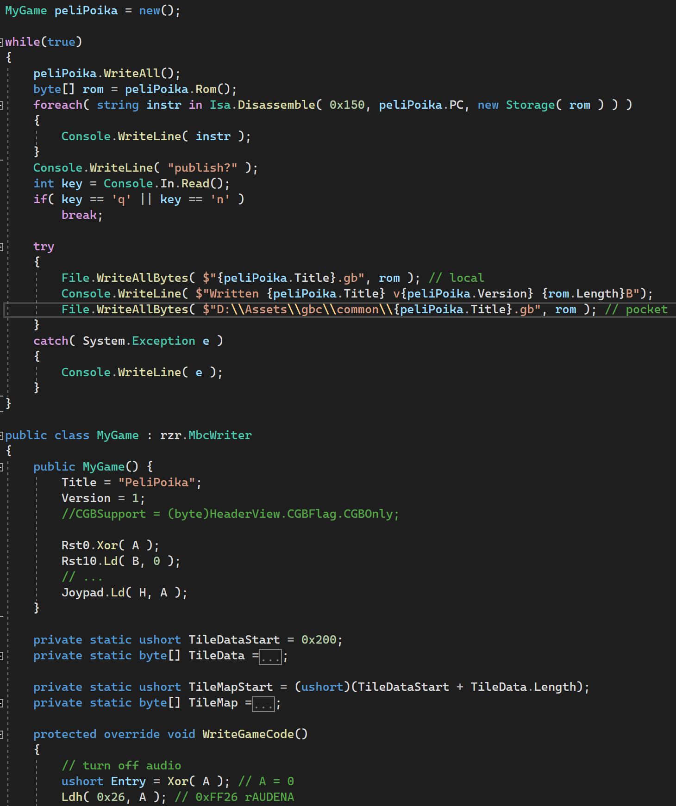

# rzrBoy Studio
GBC emu, assembler & debugger toy project in C# (was .Net Maui but thats unusable, switched to ImGui.Net which is more productive imho)

ImGui.Net based UI

.Net hotreloading helps with iterating on GB code :)

C# based GB assembly writer
